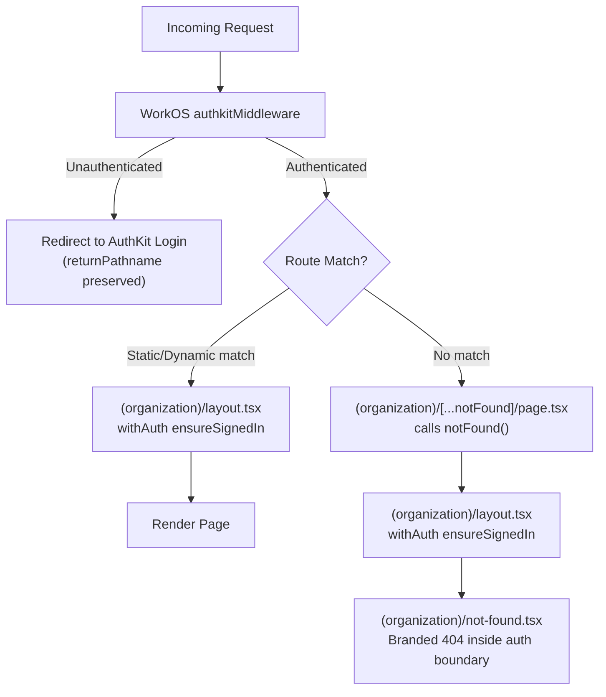

# Fix 404 Auth State Loss

## Problem

The root-level `app/not-found.tsx` renders outside the `(organization)` layout. This causes the WorkOS `AuthKitProvider` to lose auth state (`user`, `permissions`, `organizationId` all become `null/undefined`) when navigating back to authenticated pages. Symptoms: settings cog disappears, dashboard shows "Please sign in to view data."

## References

- [OWASP WSTG-INFO-04 — Route Enumeration](https://owasp.org/www-project-web-security-testing-guide/v41/4-Web_Application_Security_Testing/01-Information_Gathering/04-Enumerate_Applications_on_Webserver) — uniform responses prevent path enumeration
- [vercel/next.js#54980](https://github.com/vercel/next.js/issues/54980) — `not-found.tsx` inside route groups only triggers via explicit `notFound()` call, not for unmatched URLs
- [Atlassian KB: 404 redirect pattern](https://support.atlassian.com/confluence/kb/how-to-prevent-404-pages-from-redirecting-unauthenticated-users-to-the-login-screen/) — enterprise SaaS default: always redirect unauthenticated users to login, show 404 only after auth
- [Next.js Dynamic Routes docs](https://nextjs.org/docs/pages/building-your-application/routing/dynamic-routes) — route precedence: static > dynamic > catch-all

## Security Rationale

All unauthenticated requests receive the same response (login redirect) regardless of whether the URL exists. Only authenticated users see the 404 page. This prevents route enumeration attacks (OWASP A01).

## Architecture




## Prerequisite

Create a new branch from `preview`:

```
git fetch origin && git checkout preview && git pull origin preview
git checkout -b feat/fix-404-auth-boundary
```

## Changes

### 1. Delete `app/not-found.tsx`

Remove [app/not-found.tsx](app/not-found.tsx) entirely. The WorkOS middleware already redirects all unauthenticated requests to login. There is no legitimate scenario where an unauthenticated user would reach a root-level not-found page.

### 2. Create `app/(organization)/[...notFound]/page.tsx`

A minimal server component that calls `notFound()`. This catch-all route has the lowest routing priority (static > dynamic > catch-all), so it only triggers for genuinely unmatched URLs.

```typescript
import { notFound } from "next/navigation";

export default function CatchAllNotFound() {
  notFound();
}
```

Because this route is inside `(organization)/`, it goes through [app/(organization)/layout.tsx](app/(organization)/layout.tsx) which calls `withAuth({ ensureSignedIn: true })`. The auth session is validated server-side before the 404 page ever renders.

**Routing precedence is safe** — the following existing routes are all higher priority and will NOT be affected:

- Static routes: `/expenses`, `/settings/general`, `/profile`, etc.
- Dynamic routes: `/receipt/[id]`, `/invoice/[id]`, `/quote/[id]`, etc.
- Routes outside `(organization)`: `/login`, `/auth/callback`, `/onboarding/wizard`, `/api/`*

### 3. Create `app/(organization)/not-found.tsx`

Move the branded error screen into the organization group. This is the existing `app/not-found.tsx` content, unchanged — it is a `"use client"` component using `BrandedErrorScreen`, `buildQuickLinks`, and `createReferenceId`. Since it renders inside the `(organization)` layout, the `AuthKitProvider` remains mounted and stable.

### 4. Update tests

The existing [components/errors/**tests**/BrandedErrorScreen.test.tsx](components/errors/__tests__/BrandedErrorScreen.test.tsx) mocks `StatusIndicator` and doesn't import `not-found.tsx` directly, so no test changes are needed. Verify by running the test suite.

## Discrepancies Found

**1. `app/error.tsx` has the same structural vulnerability.**
The root-level [app/error.tsx](app/error.tsx) also renders outside `(organization)/layout.tsx`. If a runtime error occurs, it could trigger the same auth state loss. This is a separate issue from the 404 fix and should be addressed in a follow-up task (move to `app/(organization)/error.tsx` and add a minimal root `app/error.tsx` that redirects to `/`).

**2. No conflicts with onboarding/login/callback routes.**
Verified that `/onboarding/wizard`, `/onboarding/organization`, `/login`, `/auth/callback`, and all `/api/`* routes are defined as static routes outside the `(organization)` group. They take routing precedence over the catch-all and are in the middleware's `unauthenticatedPaths` list where relevant. No interference.

**3. No related open GitHub issues.**
Searched the repository's open issues — none relate to 404 handling or auth state loss after navigation.