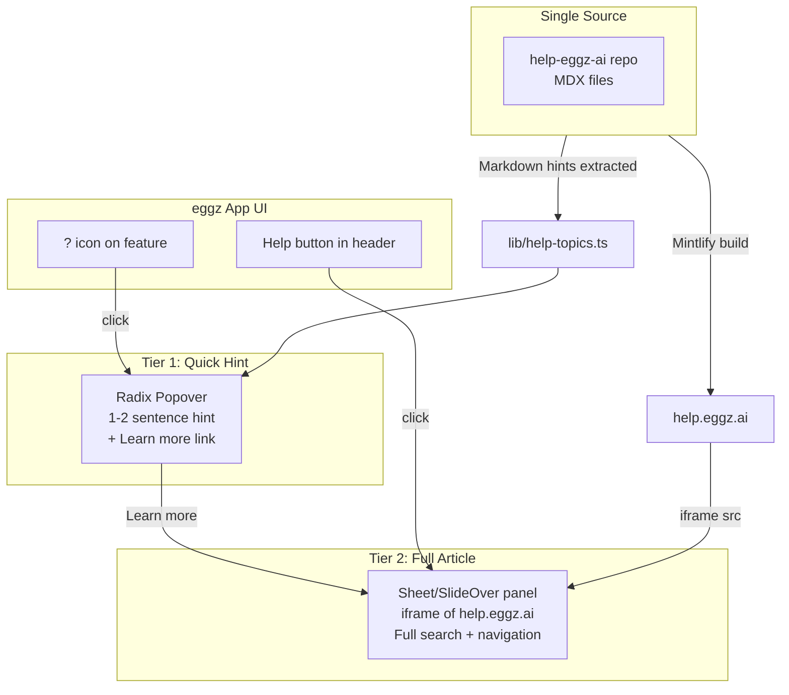
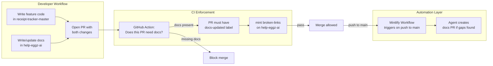

# In-App Contextual Help + Documentation Pipeline

## Part 1: In-App Contextual Help System

### Research Findings

Best-practice contextual help patterns from [Userpilot](https://userpilot.com/blog/contextual-help/), [Chameleon](https://www.chameleon.io/blog/contextual-help-ux), [GitLab Pajamas](https://design.gitlab.com/patterns/contextual-help), and [Document360](https://document360.com/blog/contextual-in-app-documentation/) converge on these principles:

- **Just-in-time**: Help appears at the point of need, not in a separate knowledge base
- **Multi-tiered**: Small hints for quick answers, full articles for depth -- same trigger, escalating detail
- **Zero context-switching**: Users should never leave the current screen to find help
- **Context-aware**: Content changes based on where the user is in the app

### Architecture




### What to Build

**1. Help Topics Registry** -- single source of truth for all help links and hints

Create `[lib/help-topics.ts](receipt-tracker-master/lib/help-topics.ts)`:

- Centralised map of ~12 app features to help URLs + short hint text
- Type-safe `HelpTopic` keys matching app areas (dashboard, uploadDocuments, expenses, etc.)
- Each entry: `{ url: string, hint: string }`
- All help.eggz.ai URLs defined in ONE file

**2. HelpHintButton component** -- the "?" icon with popover (Tier 1)

Create `[components/help/HelpHintButton.tsx](receipt-tracker-master/components/help/HelpHintButton.tsx)`:

- Uses existing Radix `Popover` from `[components/ui/popover.tsx](receipt-tracker-master/components/ui/popover.tsx)`
- Renders a small `CircleQuestionMark` icon (already imported in `[nav-data.ts](receipt-tracker-master/components/navigation/nav-data.ts)`)
- On click: shows popover with the short `hint` text + "Learn more" link
- "Learn more" opens the Sheet (Tier 2)
- Proportional to the UI -- does not dominate the feature it's helping with

**3. HelpPanel component** -- slide-out sheet with iframe (Tier 2)

Create `[components/help/HelpPanel.tsx](receipt-tracker-master/components/help/HelpPanel.tsx)`:

- New Sheet component (shadcn pattern) using Radix Dialog + framer-motion (matching existing app patterns from `[MobMenu.tsx](receipt-tracker-master/components/navigation/MobMenu.tsx)`)
- Slides in from the right, ~45% viewport width on desktop, full width on mobile
- Contains an iframe loading `help.eggz.ai` at the relevant page URL
- Header with title and close button
- Users get full Mintlify search (Cmd+K), sidebar navigation, and contextual menu inside the iframe
- URL updates based on which feature triggered the panel

**4. HelpProvider context** -- global state for the panel

Create `[components/help/HelpProvider.tsx](receipt-tracker-master/components/help/HelpProvider.tsx)`:

- React context providing `openHelp(topic: HelpTopic)` and `closeHelp()`
- Manages which URL the iframe should load
- Wrap in root layout alongside existing providers

**5. Update existing Help nav item** -- integrate with the new system

Modify the existing help dropdown in `[nav-data.ts](receipt-tracker-master/components/navigation/nav-data.ts)` line 97-115:

- "Help Centre" item changes from external link to triggering the HelpPanel at the home page
- "Community" and "Live Chat" remain as-is (external links)

**6. Place HelpHintButton on key pages** -- ~12 placements

Add `<HelpHintButton topic="..." />` to these pages:


| Page                  | Component Location                                  | Topic Key         |
| --------------------- | --------------------------------------------------- | ----------------- |
| Dashboard upload zone | `app/(organization)/page.tsx` near PDFDropzone      | `uploadDocuments` |
| Expenses page         | `app/(organization)/expenses/page.tsx` header area  | `expenses`        |
| Receipt detail        | `app/(organization)/receipt/[id]/page.tsx`          | `receipts`        |
| Bill detail           | `app/(organization)/bill/[id]/page.tsx`             | `bills`           |
| Invoices page         | `app/(organization)/invoices/page.tsx`              | `invoices`        |
| Quotes page           | `app/(organization)/quotes/page.tsx`                | `quotes`          |
| Customers page        | `app/(organization)/accounts/page.tsx`              | `customers`       |
| Contacts page         | `app/(organization)/contacts/page.tsx`              | `contacts`        |
| Integrations settings | `app/(organization)/settings/integrations/page.tsx` | `xeroConnect`     |
| General settings      | `app/(organization)/settings/general/page.tsx`      | `settings`        |
| Onboarding wizard     | `app/onboarding/wizard/page.tsx`                    | `onboarding`      |


### Why iframe (not Markdown fetch)

On the Mintlify Free plan, the iframe approach wins because:

- Full search across all help articles (Cmd+K) -- free, built-in
- Sidebar navigation between articles -- free, built-in
- Contextual menu (ChatGPT, Claude, Perplexity, MCP) -- already configured in docs.json
- Zero additional dependencies (no markdown renderer, no search API)
- Single source of truth -- same content as help.eggz.ai
- Responsive -- Mintlify's site is already mobile-optimised

### Broken Link Prevention

- All URLs defined in one file (`lib/help-topics.ts`)
- CI test validates all help URLs return HTTP 200 (as described in the earlier conversation)
- Graceful fallback: if a URL fails, open help.eggz.ai home page

---

## Part 2: Continuous Documentation Pipeline

### Goal

No feature can be released without accompanying documentation. Documentation must be an integral, enforced part of the development workflow.

### Research Findings

The [docs-as-code](https://meetzest.com/blog/doc-as-code) approach (from Zest, Fern, dev.to) and [Mintlify Workflows](https://www.mintlify.com/docs/agent/workflows) (free during beta) establish that:

- Documentation should live in Git with the same review process as code
- CI/CD should validate documentation exists and is accurate
- Automation should draft docs when code changes, not after

### Pipeline Architecture




### What to Build

**Layer 1: Cursor Rules (development-time enforcement)**

Create `[.cursor/rules/docs-required.mdc](receipt-tracker-master/.cursor/rules/docs-required.mdc)` in the app repo:

```yaml
---
description: Every user-facing feature must have corresponding documentation in the help-eggz-ai repo. When creating new pages, components, or features, always identify the help documentation that needs updating.
alwaysApply: true
---
```

This rule ensures the AI agent (Cursor) always reminds developers to update docs when writing new features. It triggers on every file edit in the app repo.

**Layer 2: PR Template (process enforcement)**

Create `[.github/PULL_REQUEST_TEMPLATE.md](receipt-tracker-master/.github/PULL_REQUEST_TEMPLATE.md)` in the app repo:

```markdown
## Documentation Checklist

- [ ] No user-facing changes (skip docs)
- [ ] Docs updated in help-eggz-ai repo (link PR: #___)
- [ ] New help topic added to `lib/help-topics.ts` (if new feature)
- [ ] Help hint text reviewed for accuracy
```

Every PR is forced to address documentation. Developers cannot merge without checking one of the boxes.

**Layer 3: GitHub Action (CI enforcement)**

Create `[.github/workflows/docs-check.yml](receipt-tracker-master/.github/workflows/docs-check.yml)` in the app repo:

- Checks if the PR touches files in `app/`, `components/`, or `actions/` directories
- If user-facing files changed, requires the `docs-updated` label OR the "No user-facing changes" checkbox
- Blocks merge if documentation is not addressed
- Validates that `lib/help-topics.ts` URLs return HTTP 200

**Layer 4: Mintlify Workflow (automated doc drafting)**

Create `[.mintlify/workflows/draft-feature-docs.md](help-eggz-ai/.mintlify/workflows/draft-feature-docs.md)` in the docs repo:

```yaml
---
name: Draft docs for new features
on:
  push:
    - repo: helpingwithtech/receipt-tracker-saas
      branch: main
context:
  - repo: helpingwithtech/docs
automerge: false
---
```

This is **free during the Mintlify Workflows beta**. When code pushes to main in the app repo, the Mintlify agent:

1. Reviews the diff
2. Identifies documentation gaps
3. Opens a PR in the docs repo with proposed updates

This acts as a safety net -- even if a developer skips docs, the automation catches it.

**Layer 5: Link validation on docs repo**

Create `[.github/workflows/validate-docs.yml](help-eggz-ai/.github/workflows/validate-docs.yml)` in the docs repo:

- Runs `mint broken-links` on every PR
- Validates all MDX files have `title` and `description` frontmatter
- Blocks merge if validation fails

### Summary of Enforcement Points


| Layer             | Where                        | When          | What it catches                   |
| ----------------- | ---------------------------- | ------------- | --------------------------------- |
| Cursor rule       | App repo, during development | Every edit    | Reminds developer to update docs  |
| PR template       | App repo, PR creation        | Every PR      | Forces docs checkbox              |
| GitHub Action     | App repo, CI                 | PR merge gate | Blocks merge without docs label   |
| Mintlify Workflow | Docs repo, automated         | Push to main  | Drafts missing docs automatically |
| Docs CI           | Docs repo, CI                | Every docs PR | Broken links, missing frontmatter |


---

## External References

- [Userpilot: Contextual Help UX Patterns](https://userpilot.com/blog/contextual-help/) -- 8 UX patterns for in-app help
- [Chameleon: Top 8 UX Patterns](https://www.chameleon.io/blog/contextual-help-ux) -- Just-in-time help design
- [GitLab Pajamas: Contextual Help](https://design.gitlab.com/patterns/contextual-help) -- When to link vs inline help
- [Document360: Contextual In-App Documentation](https://document360.com/blog/contextual-in-app-documentation) -- Reduce support tickets with embedded docs
- [Docs-as-Code Pipeline](https://dev.to/bipin_rimal314/docs-as-code-the-complete-cicd-workflow-from-git-to-production-89b) -- CI/CD for documentation
- [Mintlify Workflows](https://www.mintlify.com/docs/agent/workflows) -- Free beta automation
- [Mintlify Auto-Update Tutorial](https://www.mintlify.com/docs/guides/automate-agent) -- GitHub Actions + agent API

