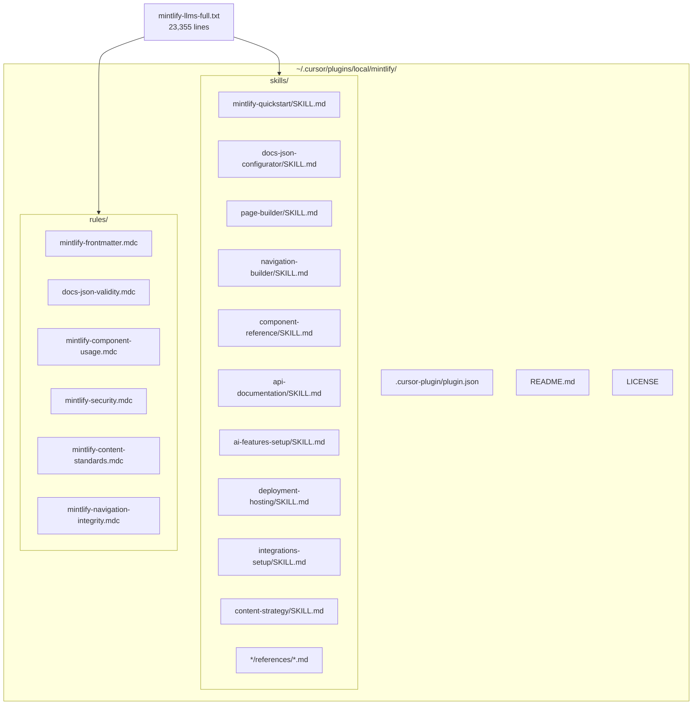

# Mintlify Cursor Plugin -- Master Plan

## Context

The source material is [mintlify-llms-full.txt](mintlify-llms-full.txt), an 883K-character (23,355-line) export of the complete Mintlify documentation. It covers agent configuration, AI features, 25+ MDX components, API playground setup, customisation, deployment across 6+ hosting providers, docs.json settings, navigation architecture, content strategy guides, i18n, SEO, and 15+ analytics integrations.

The plugin will be created at `~/.cursor/plugins/local/mintlify/` following the conventions observed in existing plugins (e.g. `local/n8n/`, `cache/cursor-public/convex/`). The existing [create-plugin-scaffold](~/.cursor/plugins/cache/cursor-public/create-plugin/e2a9918787654e001453044ea742eed826287064/skills/create-plugin-scaffold/SKILL.md) skill will be used as the scaffolding reference.

## Prerequisites

- Create a new branch `feat/mintlify-cursor-plugin` from `main` in the help-eggz-ai repo for tracking work.
- Scaffold the plugin directory at `~/.cursor/plugins/local/mintlify/` with `.cursor-plugin/plugin.json`, `README.md`, `LICENSE`, `skills/`, `rules/`, and asset directories.

## Plugin Manifest

```json
{
  "name": "mintlify",
  "displayName": "Mintlify",
  "version": "1.0.0",
  "description": "Skills and rules for Mintlify documentation: project setup, MDX components, docs.json configuration, API docs, AI features, deployment, integrations, and content strategy.",
  "author": { "name": "TechLocal" },
  "license": "MIT",
  "keywords": ["mintlify", "documentation", "mdx", "docs-as-code", "openapi", "ai-assistant", "llms-txt", "mcp"]
}
```

---

## Part 1: Skills (10 skills)

Each skill lives at `skills/<skill-name>/SKILL.md` with optional `references/` subdirectories containing extracted reference material from the source documentation.

### 1.1 -- `mintlify-quickstart`

- **Trigger**: Starting a new Mintlify project or adding Mintlify to an existing repo.
- **Source lines**: ~15072-15245 (Quickstart), ~15300-15500 (Installation/CLI)
- **Content**: CLI installation (`npm i -g mint`), repo setup, `docs.json` minimal config, `mint dev`, first deployment, web editor vs CLI workflow.
- **References**: `references/cli-commands.md` (all mint CLI commands)

### 1.2 -- `docs-json-configurator`

- **Trigger**: Configuring `docs.json` settings -- theme, colours, fonts, API, integrations, navigation.
- **Source lines**: ~13080-15070 (Global settings -- the largest single page)
- **Content**: Step-by-step docs.json setup, all top-level fields, theme selection (mint/maple/palm/willow/linden/almond/aspen/sequoia/luma), colour config, font config, API playground config, integration config, `mint.json` to `docs.json` migration.
- **References**: `references/docs-json-schema.md` (complete field reference), `references/theme-options.md`

### 1.3 -- `page-builder`

- **Trigger**: Creating or editing MDX documentation pages, configuring frontmatter.
- **Source lines**: ~12800-13080 (Pages/frontmatter), ~11074-11100 (Editor pages)
- **Content**: Frontmatter fields (title, description, icon, mode, sidebarTitle, groups, openapi, api, etc.), page modes (default, wide, center, custom), SEO metadata, keywords, timestamps, external links.
- **References**: `references/frontmatter-fields.md`

### 1.4 -- `navigation-builder`

- **Trigger**: Designing or modifying site navigation structure.
- **Source lines**: ~10800-11070 (Navigation), ~13080+ (navigation in docs.json)
- **Content**: Groups, tabs, anchors, dropdowns, menus, products, versions, languages, icons, tags, hidden items. Decision framework for when to use each navigation type.
- **References**: `references/navigation-patterns.md`

### 1.5 -- `component-reference`

- **Trigger**: Using Mintlify MDX components in documentation pages.
- **Source lines**: ~4000-7000 (all components)
- **Content**: Guide to all 25+ components organised by category -- structure (Tabs, CodeGroups, Steps, Columns, Panel), emphasis (Callouts, Banner, Badge, Update, Frames, Tooltips), API docs (ParamField, ResponseField, Expandable, RequestExample, ResponseExample), navigation (Cards, Tiles), content (Accordions, View), code blocks (highlighting, diff, expandable, wrap, line numbers).
- **References**: `references/component-syntax.md` (complete syntax for every component with examples)

### 1.6 -- `api-documentation`

- **Trigger**: Setting up API documentation -- OpenAPI, AsyncAPI, manual MDX API pages, SDK examples.
- **Source lines**: ~1270-2600 (API Playground section), ~1320-1428 (AsyncAPI)
- **Content**: OpenAPI auto-generation, manual MDX API pages, AsyncAPI websocket docs, SDK code samples (`x-codeSamples`), page visibility (`x-hidden`, `x-excluded`), playground configuration (interactive/simple/none/auth), complex data types (oneOf/anyOf/allOf).
- **References**: `references/openapi-extensions.md`, `references/api-playground-config.md`

### 1.7 -- `ai-features-setup`

- **Trigger**: Configuring Mintlify AI features -- assistant, agent, contextual menu, MCP, llms.txt, skill.md, workflows.
- **Source lines**: ~1-650 (Agent), ~651-700 (AI-native), ~700-992 (Assistant), ~993-1160 (Contextual menu), ~15247-15500 (llms.txt, skill.md, MCP)
- **Content**: Assistant setup and customisation (ASSISTANT.md), agent configuration (AGENTS.md), contextual menu options, MCP server connection, llms.txt auto-generation, skill.md setup, workflow creation (cron/push triggers, frontmatter, prompts), Discord/Slack bot setup.
- **References**: `references/agent-workflows.md`, `references/contextual-menu-options.md`

### 1.8 -- `deployment-hosting`

- **Trigger**: Deploying docs, configuring custom domains, subpath hosting, or authentication.
- **Source lines**: ~9030-9100 (Deployments), ~9081-9100 (Subpath), ~8500-9000 (CSP, auth)
- **Content**: Auto-deploy via GitHub, manual deployment, custom domains, subpath hosting (Cloudflare Workers, Vercel rewrites, AWS CloudFront, reverse proxy), preview deployments, authentication setup (JWT, shared session), CSP configuration.
- **References**: `references/hosting-providers.md`

### 1.9 -- `integrations-setup`

- **Trigger**: Adding analytics, custom CSS/JS, or third-party integrations.
- **Source lines**: ~21065-23355 (all analytics integrations), ~6900-7060 (Custom CSS/JS)
- **Content**: Analytics provider setup (GA4, GTM, Amplitude, Mixpanel, Hotjar, Fathom, Segment, PostHog, Plausible, Pirsch, etc.), custom CSS targeting (element class reference), custom JavaScript injection, Intercom/Front support chat.
- **References**: `references/analytics-integrations.md` (all provider configs), `references/css-class-reference.md`

### 1.10 -- `content-strategy`

- **Trigger**: Writing content, planning documentation structure, i18n, accessibility, SEO optimisation.
- **Source lines**: ~18900-21060 (Guides index + all guide pages)
- **Content**: Content types (tutorials, how-tos, references, explanations), content templates, writing style guide, SEO best practices, accessibility guidelines, i18n setup (language codes, file structure, navigation), media usage, linking strategies, audience analysis.
- **References**: `references/content-templates.md`, `references/i18n-language-codes.md`

---

## Part 2: Rules (6 rules)

Each rule lives at `rules/<rule-name>.mdc` with YAML frontmatter.

### 2.1 -- `mintlify-frontmatter.mdc`

- **Scope**: `globs: ["**/*.mdx"]`
- **Enforces**: All MDX files must have `title` and `description` frontmatter. Descriptions must be 50-160 characters. Headings must start at h2 (h1 is reserved for title). Alt text required on all images.

### 2.2 -- `docs-json-validity.mdc`

- **Scope**: `globs: ["**/docs.json"]`
- **Enforces**: Must include `$schema` (recommended for editor support), `theme`, `name`, `colors.primary`, and `navigation`. Theme must be one of: `mint`, `maple`, `palm`, `willow`, `linden`, `almond`, `aspen`, `sequoia`, `luma`. Colour values must be valid hex codes.

### 2.3 -- `mintlify-component-usage.mdc`

- **Scope**: `globs: ["**/*.mdx"]`
- **Enforces**: Correct component syntax (e.g. `<Steps>` wraps `<Step>`, `<AccordionGroup>` wraps `<Accordion>`, `<CardGroup>` wraps `<Card>`). Code blocks must have language tags. Images must be wrapped in `<Frame>` with alt text.

### 2.4 -- `mintlify-security.mdc`

- **Scope**: `globs: ["**/*.mdx", "**/docs.json", "**/*.js"]`
- **Enforces**: Never hardcode API keys or secrets in docs.json integrations config. Custom JavaScript must not introduce XSS vulnerabilities. Warn about CSP implications of custom JS/CSS.

### 2.5 -- `mintlify-content-standards.mdc`

- **Scope**: `alwaysApply: true`
- **Enforces**: Second-person voice ("you"). Active voice preferred. Relative paths for internal links. Language tags on all code blocks. Prerequisites at the start of procedural content. Test code examples before publishing.

### 2.6 -- `mintlify-navigation-integrity.mdc`

- **Scope**: `globs: ["**/docs.json"]`
- **Enforces**: All page paths in navigation must reference existing files. Tab, group, and anchor names must be descriptive. No orphaned pages (pages not reachable from navigation).

---

## Part 3: Reference Material Extraction

Each skill's `references/` directory will contain concise, structured reference documents extracted and distilled from the source documentation. Key reference files:


| Reference File              | Source Coverage                    | Purpose                                        |
| --------------------------- | ---------------------------------- | ---------------------------------------------- |
| `cli-commands.md`           | Installation section               | All `mint` CLI commands and flags              |
| `docs-json-schema.md`       | Global settings (~2000 lines)      | Complete docs.json field reference             |
| `frontmatter-fields.md`     | Pages section                      | All frontmatter fields with types and defaults |
| `component-syntax.md`       | Components section (~3000 lines)   | Every component with syntax and examples       |
| `openapi-extensions.md`     | API Playground section             | Mintlify-specific OpenAPI extensions           |
| `analytics-integrations.md` | Integrations section (~2000 lines) | All analytics provider configurations          |
| `css-class-reference.md`    | Custom CSS section                 | All targetable CSS class names                 |
| `navigation-patterns.md`    | Navigation section                 | Decision tree for navigation types             |
| `content-templates.md`      | Guides section                     | Templates for tutorials, how-tos, etc.         |
| `i18n-language-codes.md`    | Internationalization section       | Supported language codes and file structure    |


---

## Architecture Diagram




---

## Implementation Strategy

Each sub-plan will focus on one vertical slice and can be executed independently:

- **Sub-plan A**: Plugin scaffold + manifest + README (prerequisite for all others)
- **Sub-plan B**: Skills 1.1-1.4 (project setup, docs.json, pages, navigation) -- "Foundation skills"
- **Sub-plan C**: Skills 1.5-1.6 (components, API docs) -- "Content authoring skills"
- **Sub-plan D**: Skills 1.7-1.8 (AI features, deployment) -- "Platform skills"
- **Sub-plan E**: Skills 1.9-1.10 (integrations, content strategy) -- "Enhancement skills"
- **Sub-plan F**: All 6 rules -- "Enforcement rules"
- **Sub-plan G**: Reference material extraction -- "Reference files"
- **Sub-plan H**: Quality review and final validation

---

## External References

- [Mintlify Documentation](https://mintlify.com/docs) -- Official Mintlify docs
- [docs.json Schema](https://mintlify.com/docs.json) -- JSON schema for validation
- [Cursor Plugin Architecture](https://github.com/cursor/plugins) -- Plugin manifest and component conventions
- [llms.txt Standard](https://llmstxt.org) -- Industry standard for AI-friendly content
- [OWASP Top 10](https://owasp.org/www-project-top-ten/) -- Security standards applied in rule 2.4

